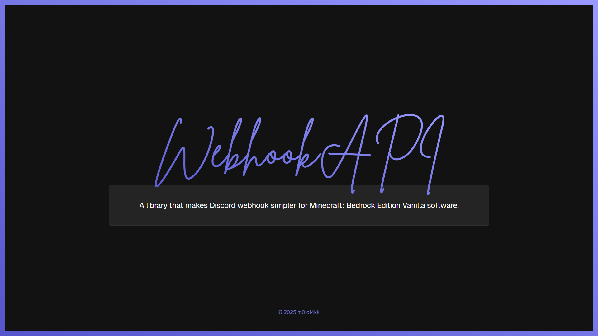

<p align="center">
    Webhook API is an API that makes dealing with Discord Webhooks much easier than using raw requests. API covers 100% support of Discord possibilities and is built on-top single Minecraft library!
</p>

# 📦 INSTALLATION

1. Navigate to [releases](https://github.com/m0lc14kk/WebhookAPI/releases) and download the latest one.

2. Install `index.js` and `index.d.ts` files and drag them into your project.

3. Start using our API in your code! You can use [examples](https://github.com/m0lc14kk/WebhookAPI/tree/main/examples) to check if you have done eveyrthing right.

# 📌 REQUIREMENTS

Before you will begin with installation this API, create a basic add-on template before. It should have atleast a manifest and a scripting folder.

- ### BDS:
    - Activate **Experimental Beta API** experiment in a world. You can find this option in _Experiments_ section of a world.
    - Add `@minecraft/server-net` module to server's permissions (`config/default/permissions.json`):
        ```json
        {
            "allowed_modules": [
                // Other modules do not matter.
                "@minecraft/server-gametest",
                "@minecraft/server",
                "@minecraft/server-ui",
                "@minecraft/server-admin",
                "@minecraft/server-editor",
                "@minecraft/server-net" // Paste this module at the end of a file.
            ]
        }
        ```
    - Add `@minecraft/server-net` to pack's manifest:
        ```json
        {
            "dependencies": [
                // Other dependencies.
                {
                    "module_name": "@minecraft/server-net",
                    "version": "1.0.0-beta" // Version do not matter.
                }
            ]
        }
        ```

- ### Worlds/Realms:
    At this moment, worlds are not supported. Consider using redirects with `@minecraft/server-admin` and `transferPlayer` function to an external server.
