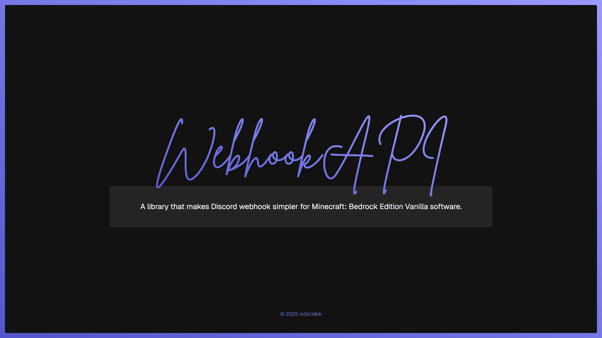

<p align="center">
    Webhook API - Security Policy
</p>

---

## ⚠️ Supported Versions

The following table shows which versions of the project are currently being supported by Bedrock Dedicated Server with security updates:

| Version  | Supported |
| -------- | --------- |
| 1.1.0 🆕 | 1.19.40^  |
| 1.0.0    | 1.20.10^  |

Versions of players, that are playing on a server does not matter.

If your server is running on older versions, it's better to use `HttpMethodNameManager` class to change server's version.

```ts
import { HttpMethodNameManager } from "webhook-api"

// Versions below 1.21.10 are mostly affected.
HttpMethodNameManager.setVersion("1.21.10")
```

## 🔎 Reporting a Vulnerability

If you are having troubles with API, create an issue on GitHub, using _Bug Report_ template. Remember, sometimes it might take a bit longer to fix or implement new API features.
